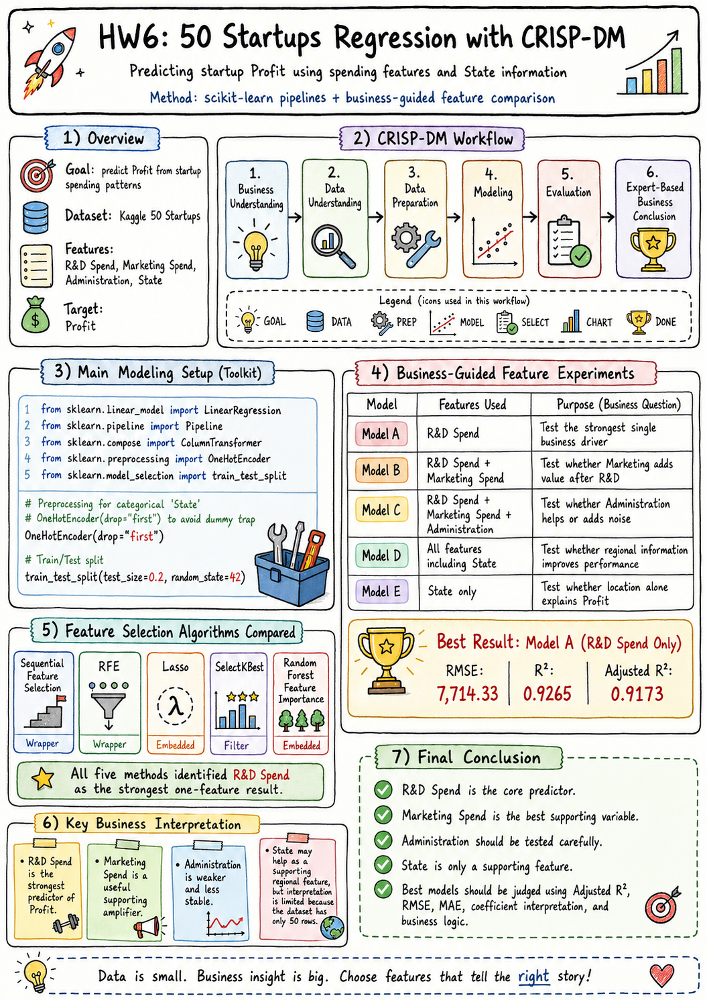

# Kaggle 50 Startups Linear Regression Analysis

## Project Overview

This project analyzes the Kaggle 50 Startups dataset using Multiple Linear Regression.
The goal is to predict company profit based on business spending features and state information,
following the CRISP-DM machine learning workflow.



## Dataset

The dataset is stored in:

`sources/50_Startups.csv`

Columns:

- R&D Spend
- Administration
- Marketing Spend
- State
- Profit

The `sources/` folder contains the original dataset and should not be deleted.

## Project Structure

| File or Folder | Description |
|---|---|
| `src/modeling.py` | Main executable CRISP-DM analysis script |
| `src/compare_feature_selections.py` | Integrated comparison of the four feature-selection analyses |
| `streamlit_app.py` | Interactive Streamlit app (tutorial slides, data exploration, model comparison, profit predictor) |
| `tutorial/index.html` | Standalone tutorial webpage for the presentation deck |
| `sources/50_Startups.csv` | Original dataset |
| `outputs/figures/` | Generated charts and the workflow image |
| `outputs/metrics/` | Generated CSV metric tables |
| `design.md` | Project design requirements |
| `hw6.md` | Homework report summary |
| `archive/` | Earlier draft scripts and development log (reference only) |
| `startup-presentation-video-pptx/` | Presentation video project and final MP4 render |

## Methodology

This project follows the CRISP-DM process:

1. Business Understanding
2. Data Understanding
3. Data Preparation
4. Modeling
5. Evaluation
6. Deployment / Reporting

Workflow image: `outputs/figures/workflow.png`

## Experiments

The project includes experiments on:

- Using 1 to 4 numerical/business features (Models A–E)
- Evaluating the effect of the `State` categorical variable with `OneHotEncoder(drop="first")`
- Comparing model performance using RMSE, MAE, R², and Adjusted R²
- Five feature selection algorithms: Sequential Feature Selection, RFE, Lasso,
  SelectKBest, and Random Forest Feature Importance

## How to Run

Run from the project root:

```bash
pip install -r requirements.txt
python src/modeling.py
```

The script loads the dataset (URL first, local `sources/50_Startups.csv` as fallback),
performs CRISP-DM analysis, trains the regression models, compares feature sets,
runs the feature selection algorithms, and saves all results.

Interactive app:

```bash
streamlit run streamlit_app.py
```

Tutorial webpage: open `tutorial/index.html` in a browser (slide images are loaded
from `startup-presentation-video-pptx/assets/slides/`, so keep the repo layout intact).

## Outputs

Generated outputs are saved under:

- `outputs/figures/` — PNG charts
- `outputs/metrics/` — CSV metric tables

Key result images:

| Output | File |
|---|---|
| **Integrated feature-selection comparison (all four analyses)** | `outputs/figures/feature_selection_integrated_comparison.png` |
| Feature selection all-in-one summary | `outputs/figures/feature_selection_performance_allinone_summary.png` |
| Business-guided feature selection | `outputs/figures/business_guided_feature_selection_summary.png` |
| Marketing vs Administration comparison | `outputs/figures/marketing_vs_administration_comparison.png` |
| Model comparison by Adjusted R² | `outputs/figures/model_comparison_adjusted_r2.png` |
| Model comparison by RMSE | `outputs/figures/model_comparison_rmse.png` |
| Best model actual vs predicted | `outputs/figures/best_model_actual_vs_predicted.png` |

## Best Model Result

The best model on the current test split is:

`Model A: R&D Spend Only`

| Metric | Value |
|---|---:|
| R² | `0.9265` |
| Adjusted R² | `0.9173` |
| MAE | `6,077.36` |
| RMSE | `7,714.33` |

## Business Conclusion

`R&D Spend` is the strongest profit driver. `Marketing Spend` is a useful supporting
feature and performs better than `Administration` when compared after R&D.
`Administration` is less stable, and `State` should be treated as a supporting feature
only, because the dataset has just 50 rows.
